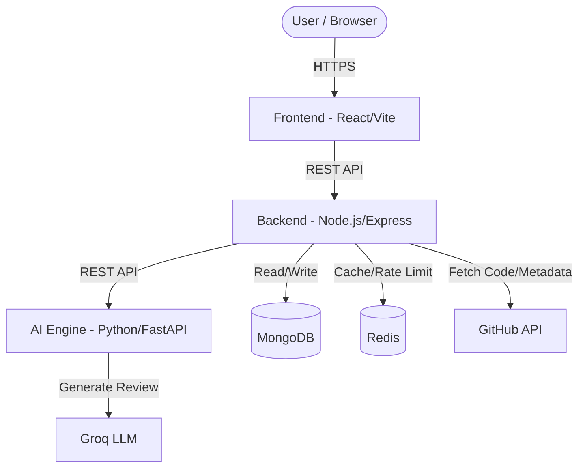

# RepoSage Architecture

This document outlines the high-level architecture of RepoSage. The platform consists of a frontend (React), a backend (Node.js/Express), an AI Engine (Python/FastAPI), and external dependencies like MongoDB, Redis, and GitHub.

## System Diagram

## Components

1. **Frontend**: Built with React and Vite. It provides the user interface for developers to log in with GitHub, view their repositories, and request AI code reviews.
2. **Backend**: Built with Node.js and Express. It acts as the orchestrator. It handles GitHub OAuth, manages sessions, fetches repository data from GitHub, stores metadata in MongoDB, and communicates with the AI Engine.
3. **AI Engine**: A Python service (using FastAPI) that is responsible for processing code, managing RAG (Retrieval-Augmented Generation), and communicating with the Groq API (or other LLMs) to generate the actual code review insights.
4. **Database (MongoDB)**: Stores user data, repository metadata, and review histories.
5. **Cache (Redis)**: Used for rate limiting and caching frequently accessed data or analysis results to improve performance and avoid hitting API rate limits.
6. **External APIs**: Relies heavily on the GitHub API for source code fetching and OAuth, and Groq for LLM capabilities.
